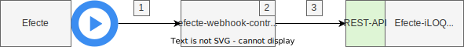

# efecte-webhook-controller

## Kuvaus

efecte-webhook-controller on yksinkertainen viestin välittäjä, joka vastaanottaa Efecten herätteen polkuun `/webhook` ja välittää sen eteenpäin Efecte-iLOQ integraatiolle.

## Tiedot

**Lähteen yhteyspiste**: HTTP

**Kohteen yhteyspiste**: HTTP

- rajapinta: /webhook

## Integraation kulku



1. Efecten järjestelmästä lähetetään efecte-webhook-controllerin tarjoamaan rajapintaan http-pyyntö (http-metodi: POST)
2. Webhook-kontrolleri ottaa viestin talteen, käsittelee sen synkronisesti ja palauttaa lähettäjälle statuskoodin 200. Webhook-kontolleri ei validoi sanomaa, mutta se vaatii autentikoinnin. Autentikointi hoidetaan `Authorization` otsakkeella, jossa `Bearer WEBHOOK_API_TOKEN` arvo.
3. Vastaanotettu sanoma lähetetään Efecte-iLOQ integraation tarjoamaa rajapintaan.

## Paikallinen kehitys

Varmista, että paikallisessa kehityksessä .env -tiedosto on olemassa ja se näyttää seuraavalta.

```env
WEBHOOK_API_TOKEN=foo
INTEGRATION_ENDPOINT=integration-endpoint
KEY_EXPIRATION_SECONDS=60
LEADER_POD_KEY_EXPIRATION_SECONDS=3
```
